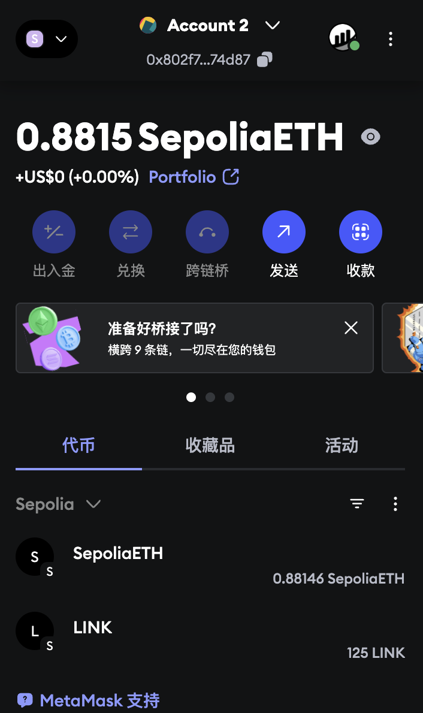

# 12 ETH入门

### Ethereum

- 2013年构思，2015年上线，2022年由POW转向POS
- 12秒出一个块（block），对比btc10分钟出一个块效率上高很多


### POS

- 三类角色：验证者（Validator）、提议者（Proposer）、见证者（Attester）
- 节点分为全节点和归档节点，但是节点要任意质押 32 个 ETH 并运行客户端，才可成为验证者
- ETH 不依赖外部时间，区块高度/slot 是其内部“时间”

#### 出块过程

1. 每个 slot（12 秒）随机选出一名提议者，和几千名见证者
2. 提议者打包本 slot 的交易，构建新区块
3. 见证者对区块投票，若超过 2/3 权重通过，区块“已证明”
4. 下一个区块也被证明后，前一个区块变为“已确定”，不可更改


### 区块数据

- 区块头和btc类似
- 如果btc区块体表示为from to value三个字段，那么eth的区块体就多了一个字段data
- 这个字段data是solidity的智能合约代码编译后的字节码
- 对比btc的记账系统，eth网络中的的EVM可以对这个data字段的合约代码字节码做响应
- EVM不需要知道你的ABI就可以帮你执行代码调用，因为你创建代码的本地Remix或者Hardhat在帮你编译sol代码的时候就已经生成了ABI，你要在etherscan上面开源你的代码也需要上传ABI和源代码本身
- 为了让别人调用你这个合约代码，你需要提供ABI数据，以及你的合约账户地址


### 两种账户

- eth中有两种账号，外部拥有账户Externally Owned Account和合约账户Contract Account

| 属性           | 外部账户（EOA）    | 合约账户（合约）             |
| -------------- | ------------------ | ---------------------------- |
| 控制方式       | 由私钥控制         | 由链上的代码控制             |
| 是否能发起交易 | ✅ 可以主动发起     | ❌ 不能主动发起               |
| 是否包含代码   | ❌ 没有代码         | ✅ 包含合约代码               |
| 能否被调用     | ✅ 可以             | ✅ 可以（通过交易或内部调用） |
| 常见形式       | 钱包账户、用户地址 | NFT 合约、DEX、代币合约      |

- 生活中的比喻
  - **EOA 是“人”**：你（用户）可以主动做事，比如转账、发起投票。
  - **合约账户是“机器人”**：它不会主动做事，只有你按下按钮（发起交易）它才启动，然后按照程序完成任务。


### 数据存储结构：区块头、区块体、状态树（默克尔树）

### 🧱 1. 区块头（Block Header）

- 区块的元信息汇总，包括：
  - 区块高度（编号）
  - 父区块哈希（指向上一个区块）
  - `stateRoot`：当前区块对应的状态树根哈希（指向所有账户状态的树）
  - `transactionsRoot`：交易树根
  - `receiptsRoot`：收据树根
- **关键点**：`stateRoot` 是进入“全网账户状态快照”的入口。

------

### 📦 2. 区块体（Block Body）

- 保存本区块内打包的所有交易。
- 每笔交易记录了：
  - from、to、value、gas、input 等信息
- 区块体中的交易最终会**更新状态树**（也就是状态树是“交易执行完”的结果）。

------

### 🌳 3. 状态树（Merkle Patricia Trie，简称 MPT）

- 是一种**多叉树**（非二叉） + 前缀压缩结构。
- 根哈希（`stateRoot`）记录在区块头中，指向这一时刻的“全网状态快照”。
- 叶子节点保存了所有账户的状态信息，包括：
  - `nonce`：交易计数器
  - `balance`：账户余额
  - `codeHash`：合约账户的代码哈希
  - `storageRoot`：合约账户的存储状态根

------

### 

### gas费以及计算规则

#### 📦 Gas 组成

1. **Base Fee（基础费用）**

   - 网络自动设定的最低费用，用于抵御网络拥堵。
   - 每个区块会根据网络使用情况自动调整 base fee（涨/跌最多 12.5%）。

2. **Tip（优先费，或 Max Priority Fee）**

   - 给打包交易的验证者的小费，鼓励更快打包。
   - 用户自己设置，越高越容易被优先处理。

3. **Max Fee（最大费用，或 Max Fee Per Gas）**

   - 用户愿意支付的最多 Gas 费（含 base fee + tip）上限。

4. ##### 实际支付金额

   `Gas Fee = min(Max Fee, Base Fee + Tip) × Gas Used`


## 作业


使用 Remix 创建一个 Counter 合约并部署到**任意以太坊测试网**:
Counter 合约具有

1. 一个状态变量 counter
2. `get()`方法: 获取 counter 的值
3. `add(x)` 方法: 给变量加上 x 。

请在回答框内提交调用 `add(x)` 的交易 Hash 的区块链浏览器的 URL。

提交代码如下：实际部署至sepolia测试网

```solidity
// SPDX-License-Identifier: MIT
pragma solidity 0.8.17;

contract Counter {
    uint public counter = 0;

    function get() public view returns(uint){
        return counter;
    }

    function add(uint x) public {
        counter += x;
    }
}
```

调用add的浏览器URL：https://sepolia.etherscan.io/tx/0x213c2685faad51a8be33c4a6cd62c7742ebefad5ca771af9b00508b5f3fe6336

发起转账的tx的浏览器URL：https://sepolia.etherscan.io/tx/0xbb77d4bbc89948170cfecb5ad15586bc088342e60d1e50e22cdbebe5f05441b4

钱包首页如下：

